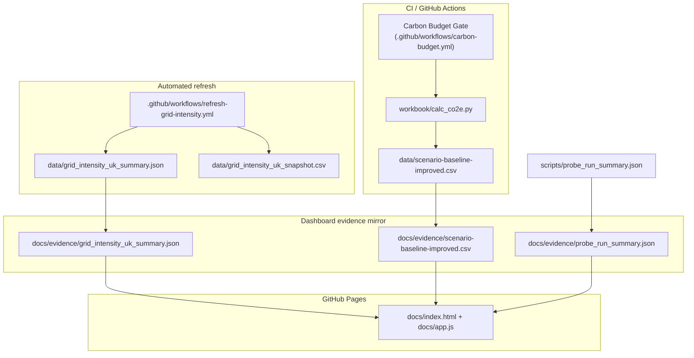

[](https://github.com/vlad12-k/green-ai-sizer-mvp)
[](https://github.com/vlad12-k/green-ai-sizer-mvp/actions/workflows/carbon-budget.yml)
[](https://github.com/vlad12-k/green-ai-sizer-mvp/actions/workflows/refresh-grid-intensity.yml)
[](https://vlad12-k.github.io/green-ai-sizer-mvp/)

# Green AI Sizer MVP

Green AI Sizer is a lightweight, auditable toolkit for teams running AI-assisted services who need to keep performance and emissions under control: it combines carbon-aware scenario sizing, CI enforcement, and a live evidence dashboard so sustainability controls are verifiable in day-to-day delivery.

## Product overview
- **Who it is for:** engineering teams, platform owners, and sustainability/governance stakeholders.
- **What problem it solves:** makes AI routing/caching trade-offs measurable and enforceable rather than aspirational.
- **How it is delivered:** static dashboard + versioned evidence + CI budget gate.

## What makes this production-grade
- **CI Carbon Budget Gate:** `.github/workflows/carbon-budget.yml` runs `python workbook/calc_co2e.py 200` and blocks budget regressions.
- **Evidence pack:** dashboard consumes committed files under `docs/evidence/` only.
- **Automated refresh:** `.github/workflows/refresh-grid-intensity.yml` updates grid evidence and opens auto-merge PRs when configured.
- **Automated checks:** `make check` validates evidence contracts and critical output shapes.

## Where is the AI?
Small-first routing is implemented by the router classifier in:
- `app/ml/router.py` (runtime routing logic)
- `app/ml/router_model.joblib` (trained routing artifact)
- `app/ml/train_router.py` (router training script)

The product uses this classifier to prioritize small-model paths when suitable, then reports the observed routing and cache metrics in evidence used by the dashboard.

## Live proof
- **Dashboard (GitHub Pages):** https://vlad12-k.github.io/green-ai-sizer-mvp/
- **Dashboard evidence JSON (live):**
  - https://vlad12-k.github.io/green-ai-sizer-mvp/evidence/grid_intensity_uk_summary.json
  - https://vlad12-k.github.io/green-ai-sizer-mvp/evidence/probe_run_summary.json
- **Refresh workflow page:** https://github.com/vlad12-k/green-ai-sizer-mvp/actions/workflows/refresh-grid-intensity.yml *(open latest run)*
- **Evidence sync workflow page:** https://github.com/vlad12-k/green-ai-sizer-mvp/actions/workflows/sync-dashboard-evidence.yml *(open latest run)*

## Architecture


- Full architecture notes: `docs/architecture/system-architecture.md`

## How to verify evidence
1. Run `make check` locally.
2. Open the dashboard and confirm **Last updated** is populated from `evidence/grid_intensity_uk_summary.json`.
3. Open the live evidence links above and confirm they match dashboard KPIs.

## Docs
- Evidence index: `docs/evidence/index.md`
- Data provenance: `docs/evidence/data-sources.md`
- Controls: `docs/governance/controls.md`
- Runbook: `docs/governance/runbook.md`
- Risk register: `docs/governance/risk-register.md`
- RACI: `docs/governance/raci.md`
- KPI definitions: `docs/governance/kpis.md`
- Ops verification: `docs/ops/verification.md`
- Migration mapping: `MIGRATION.md`

## Quickstart
```bash
python workbook/calc_co2e.py 200
make check
```

## License
[MIT](LICENSE)
