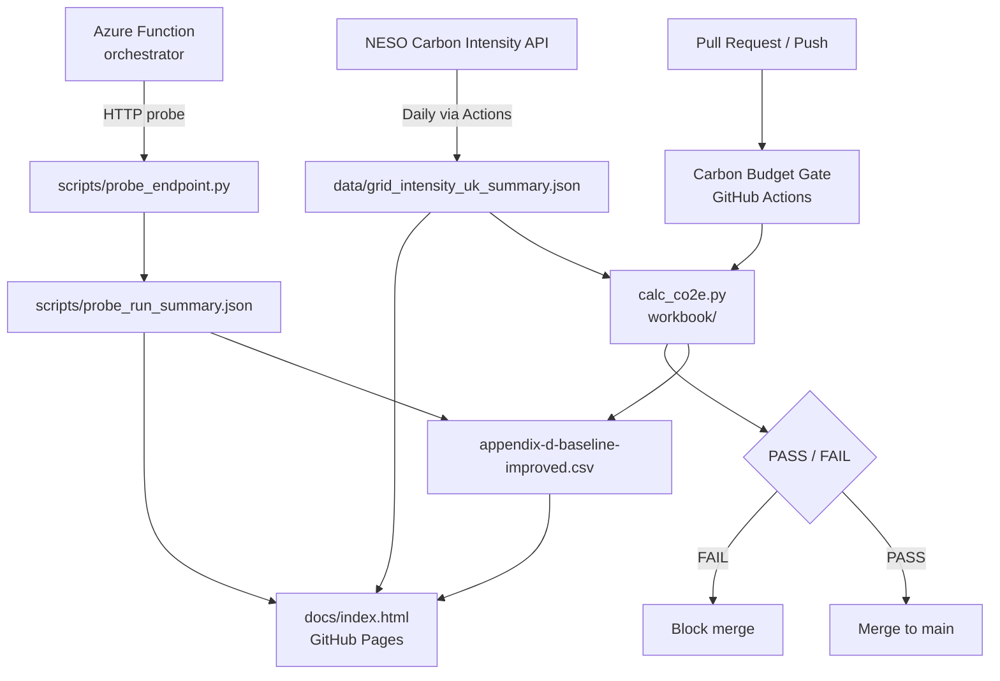

[](https://github.com/vlad12-k/green-ai-sizer-mvp/actions/workflows/carbon-budget.yml)

# Green AI Sizer MVP

Governance-first toolkit and evidence pack for **Responsible AI Sizing**: enforcing a CI Carbon Budget Gate, capturing real UK grid-intensity data, and providing an optional live Azure Function endpoint.

> **How do we prevent AI usage from silently increasing operational emissions while maintaining service readiness under heatwaves and grid volatility?**

---

## Summary

| Item | Value | Source |
|---|---|---|
| CI budget status | See badge above | `.github/workflows/carbon-budget.yml` |
| Baseline gCO₂e / 1k requests | **159.70 g** | `workbook/appendix-d-baseline-improved.csv` |
| Improved gCO₂e / 1k requests | **50.69 g** | `workbook/appendix-d-baseline-improved.csv` |
| Reduction vs baseline | **68.3 %** | `workbook/calc_co2e.py` |
| Grid intensity avg (UK, last 24 h) | **79.85 gCO₂/kWh** | `data/grid_intensity_uk_summary.json` |
| Grid intensity snapshot date | 2026-03-02T14:58 UTC | `data/grid_intensity_uk_summary.json` |
| Probe: cache hit rate | **31 %** | `scripts/probe_run_summary.json` |
| Probe: small route rate | **60 %** | `scripts/probe_run_summary.json` |
| Probe: avg latency | **122 ms** (p95: 200 ms) | `scripts/probe_run_summary.json` |
| Monitoring dashboard | [docs/index.html](docs/index.html) | GitHub Pages |

---

## Table of contents

- [Problem](#problem)
- [Why it matters](#why-it-matters)
- [What this repository enforces](#what-this-repository-enforces)
- [Quickstart](#quickstart)
- [Evidence trail](#evidence-trail)
- [Live endpoint (optional)](#live-endpoint-optional)
- [Monitoring dashboard](#monitoring-dashboard)
- [Architecture](#architecture)
- [Governance and assurance](#governance-and-assurance)
- [Security and compliance](#security-and-compliance)
- [Roadmap](#roadmap)
- [License](#license)

---

## Problem

Climate-critical services depend on always-on digital systems. Under **heatwaves**, cooling demand rises and infrastructure stress increases. Under **grid volatility**, carbon intensity fluctuates hour-by-hour and peak-demand constraints tighten.

AI-enabled workflows can improve operational responsiveness, but **uncontrolled inference demand** silently becomes a baseline load — increasing emissions and operational cost unless actively governed.

---

## Why it matters

Optimising for efficiency alone can trigger **rebound effects**: lower inference cost → higher usage → higher total emissions. Governance disciplines that address this include:

- **Sizing** — small-first model routing, escalation only when confidence is insufficient.
- **Caching** — avoid repeated inference on semantically equivalent prompts.
- **Inference control** — budget gates, demand quotas, feature-level accounting.

Without measurable KPIs and enforceable controls, sustainability commitments remain narrative statements rather than operational constraints.

---

## What this repository enforces

### 1. Carbon Budget Gate (CI required check)

A GitHub Actions workflow computes **gCO₂e / 1,000 requests** from workbook inputs on every pull request and push to `main`. CI fails when the improved scenario exceeds the configured budget threshold. Results appear in the GitHub Actions run summary.

### 2. Reproducible calculation method

- Workbook inputs: `workbook/appendix-d-baseline-improved.csv`
- Calculator: `workbook/calc_co2e.py`
- Outputs: gCO₂e / 1k requests (baseline + improved), total gCO₂e/day, estimated reduction.

### 3. Evidence pack (auditable appendices)

- Boundary and assumptions: `docs/appendix-c-boundary.md`
- Data sources and provenance: `docs/appendix-d-data-sources.md`
- Stakeholders and RACI: `docs/appendix-e-raci.md`
- KPI definitions and reporting cadence: `docs/appendix-f-kpis.md`
- Risk register and mitigations: `docs/appendix-g-risk-register.md`

### 4. Product-grade repository controls

- `main` protected: PR-only merges, required checks (carbon-budget; CodeQL), no force-push.
- Dependency and code scanning where enabled.
- Reproducible development environment via Codespaces devcontainer.

---

## Quickstart

```bash
# Clone and run the CO₂e budget check locally
git clone https://github.com/vlad12-k/green-ai-sizer-mvp.git
cd green-ai-sizer-mvp
python workbook/calc_co2e.py 200
```

What this does:

- Reads scenario inputs from `workbook/appendix-d-baseline-improved.csv`
- Uses grid intensity from `data/grid_intensity_uk_summary.json`
- Computes baseline and improved gCO₂e per 1k requests and total per day
- Prints a PASS/FAIL decision against the given budget

Expected output (shape):

```
Budget (gCO2e/1k): 200.00
Baseline gCO2e per 1k requests: 159.70 gCO2e
Baseline total gCO2e/day: 159.70 gCO2e
Improved gCO2e per 1k requests: 50.69 gCO2e
Improved total gCO2e/day: 50.69 gCO2e
PASS: Within budget.
```

This same logic is enforced in CI by the Carbon Budget Gate workflow.

---

## Evidence trail

All numbers displayed in this repository trace back to the files listed below. No values are invented.

| Artefact | Path | Purpose |
|---|---|---|
| Workbook scenario inputs | `workbook/appendix-d-baseline-improved.csv` | Baseline vs improved scenario parameters |
| CO₂e calculator | `workbook/calc_co2e.py` | Reproducible calculation logic |
| Probe run summary | `scripts/probe_run_summary.json` | Cache hit rate, routing, latency, Wh/request |
| Probe script | `scripts/probe_endpoint.py` | How probe evidence was collected |
| Grid intensity snapshot | `data/grid_intensity_uk_snapshot.csv` | Raw 24 h half-hourly readings |
| Grid intensity summary | `data/grid_intensity_uk_summary.json` | Min / avg / max used in workbook |
| Data provenance note | `docs/appendix-d-data-sources.md` | Source API, field mapping, reproducibility steps |
| Security policy | `SECURITY.md` | Secret handling, key rotation, scanning policy |
| Architecture | `docs/appendix-a-architecture.md` | Component diagram and narrative |
| Controls register | `docs/controls.md` | Control objectives, evidence, review cadence |
| Operator runbook | `docs/runbook.md` | Validate gate, rotate keys, refresh evidence, pause spend |

---

## Live endpoint (optional)

This repository includes an Azure Function (HTTP trigger) that demonstrates small/large model routing and per-request energy estimates under caching.

**Security rules:**

- Never commit the function key (`?code=...`).
- Store the full URL locally in a `.env` file. This repository ignores `.env` by design.

Example `.env` (local only — never commit real values):

```
URL='https://<your-function>.azurewebsites.net/api/orchestrator?code=<PLACEHOLDER>'
```

Minimal endpoint test (Codespaces or local):

```bash
set -a; source .env; set +a
curl -i -X POST "$URL" \
  -H "Content-Type: application/json" \
  -d '{"query":"what is the heatwave incident checklist","seed":1}'
```

Expected response: HTTP 200 JSON with `route`, `cache_hit`, `latency_ms`, `wh_request`.

Probe the endpoint to collect stable evidence:

```bash
set -a; source .env; set +a
python scripts/probe_endpoint.py > scripts/probe_run_summary.json
cat scripts/probe_run_summary.json
```

The probe reads `URL` from the environment. Results are committed to `scripts/probe_run_summary.json` as versioned evidence.

**Budget discipline:** run the probe at most once to generate evidence, and at most once per week to refresh numbers. Grid intensity updates are handled by GitHub Actions (`refresh-grid-intensity.yml`) at no Azure runtime cost.

To pause Azure spend: Azure Portal → Function App → Overview → Stop.

---

## Monitoring dashboard

A static GitHub Pages dashboard visualises evidence from this repository. No build tools, no external APIs, no CDN.

What it shows:

- **Summary KPIs** — budget status, baseline vs improved gCO₂e/1k, reduction, grid intensity, probe metrics.
- **Baseline vs Improved chart** — SVG bar chart sourced from `workbook/appendix-d-baseline-improved.csv`.
- **Grid intensity range** — min / avg / max bar sourced from `data/grid_intensity_uk_summary.json`.
- **Governance view** — controls register, evidence links, and review cadence.
- **Evidence provenance** — exact file paths and last-modified timestamps.

Data source: the dashboard reads committed JSON files at page load using relative paths. No external API calls are made.

Entry point: [docs/index.html](docs/index.html)

Screenshot slots (see `docs/assets/screenshots/`):

- `architecture.png` — architecture diagram
- `dashboard.png` — monitoring dashboard
- `ci-gate.png` — Carbon Budget Gate CI summary

---

## Architecture

See [docs/appendix-a-architecture.md](docs/appendix-a-architecture.md) for the component diagram and narrative.



---

## Governance and assurance

This repository treats sustainability as an enforceable constraint, not a narrative commitment.

**Control objectives:**

| Objective | Control | Evidence |
|---|---|---|
| CO₂e per request stays within budget | Carbon Budget Gate (CI) | `.github/workflows/carbon-budget.yml` run summary |
| Budget inputs are traceable and versioned | Workbook CSV under version control | `workbook/appendix-d-baseline-improved.csv` |
| Grid intensity reflects real-world data | Daily automated refresh via Actions | `data/grid_intensity_uk_summary.json` |
| Endpoint behaviour is evidenced | Versioned probe run summary | `scripts/probe_run_summary.json` |
| Secrets are never committed | `.gitignore` + SECURITY.md policy | `.gitignore`, `SECURITY.md` |

Full controls register: [docs/controls.md](docs/controls.md)  
Operator runbook: [docs/runbook.md](docs/runbook.md)  
Architecture decision records: [docs/adr/](docs/adr/)

**Review cadence:**

- Weekly: cache hit rate, routing %, p95 latency.
- Monthly: gCO₂e/1k trend, total estimated CO₂e.
- Quarterly: governance review — budgets, exceptions, risks, ADR updates.

---

## Security and compliance

See [SECURITY.md](SECURITY.md) for the full security policy, key rotation procedure, and scanning configuration.

See [THREAT_MODEL.md](THREAT_MODEL.md) for the STRIDE threat model covering this system's assets, threats, and mitigations.

See [PRIVACY.md](PRIVACY.md) for the data classification statement (no personal or clinical data; only public grid intensity + synthetic prompts).

---

## Roadmap

1. Marginal emissions sensitivity analysis (min / avg / max grid intensity scenarios in CI output).
2. Feature-level AI call accounting to detect rebound effects per team or product area.
3. Automated workbook CSV update from probe output in a hardened branch workflow.
4. Governance dashboard diff view — show changes in KPIs across commits.
5. Extended ADR set for multi-region grid intensity and PUE modelling.

---

## License

[MIT](LICENSE)
