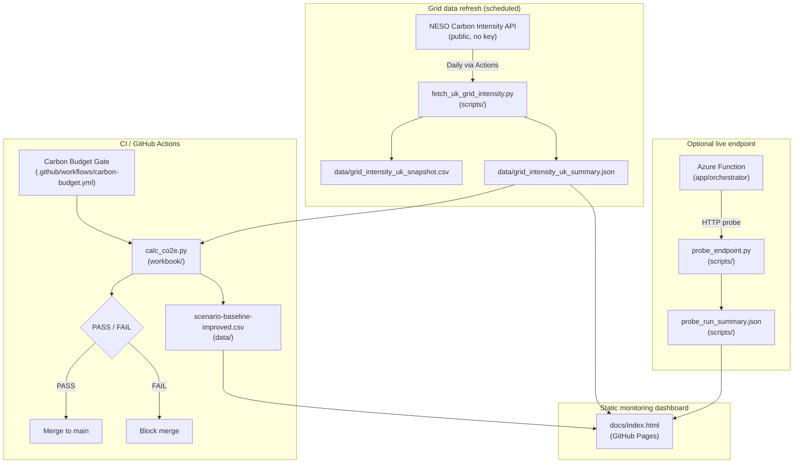

# Green AI Sizer MVP

Green AI Sizer MVP is a lightweight governance and sizing toolkit for teams operating always-on AI services, helping engineering and sustainability stakeholders keep emissions decisions auditable by turning scenario evidence into a visible dashboard, CI budget enforcement, and automated grid-intensity refresh.

## What problem it solves

AI services run continuously while grid intensity and demand conditions vary; this creates governance risk when emissions controls are not enforced. This project helps teams govern operational emissions under heatwave/grid volatility by making baseline-vs-improved sizing assumptions explicit, measurable, and continuously checked.

## How it works

1. **Evidence pack**: versioned evidence files are maintained under `docs/evidence/`.
2. **Dashboard**: GitHub Pages renders KPIs from those evidence files (`docs/index.html` + `docs/app.js`).
3. **CI Carbon Budget Gate**: pull requests and main pushes run `python workbook/calc_co2e.py 200`.
4. **Daily grid refresh automation**: scheduled workflow refreshes UK grid evidence and auto-merges automation PRs when checks pass.

## Architecture

- Evidence is captured and versioned in `docs/evidence/` and source data files under `data/`.
- The static dashboard (`docs/index.html` + `docs/app.js`) reads committed evidence artifacts and renders governance KPIs.
- The CI Carbon Budget Gate (`.github/workflows/carbon-budget.yml`) enforces the CO₂e threshold on pull requests and `main`.
- Daily refresh automation (`.github/workflows/refresh-grid-intensity.yml`) updates grid evidence and opens/updates the automation PR.
- After checks pass, the refresh PR auto-merges to `main`, and GitHub Pages serves the updated evidence-backed dashboard.

Architecture document: [docs/architecture/system-architecture.md](docs/architecture/system-architecture.md)

## Where is the AI?

This repository includes a small-first router classifier implementation in:

- `app/ml/router.py`
- `app/ml/router_model.joblib`
- `app/ml/train_router.py`

The AI contribution here is routing governance for inference demand (small-first behavior), with evidence and controls around emissions outcomes.

## Live proof

- **Dashboard (GitHub Pages):** https://vlad12-k.github.io/green-ai-sizer-mvp/
- **Evidence (GitHub Pages):**
  - https://vlad12-k.github.io/green-ai-sizer-mvp/evidence/grid_intensity_uk_summary.json
  - https://vlad12-k.github.io/green-ai-sizer-mvp/evidence/probe_run_summary.json
  - https://vlad12-k.github.io/green-ai-sizer-mvp/evidence/scenario-baseline-improved.csv
- **Workflows:**
  - Refresh grid intensity: https://github.com/vlad12-k/green-ai-sizer-mvp/actions/workflows/refresh-grid-intensity.yml
  - Carbon Budget Gate: https://github.com/vlad12-k/green-ai-sizer-mvp/actions/workflows/carbon-budget.yml

## Automation proof (what to screenshot for report)

- A successful run of `refresh-grid-intensity.yml` in Actions.
- The automation PR (`data: refresh UK grid intensity snapshot (auto)`) created and merged.
- Dashboard showing updated **Last updated** timestamp.

## Verification (3 steps)

1. Run `make check`
2. Run `python workbook/calc_co2e.py 200`
3. Open dashboard and confirm **Last updated** matches `docs/evidence/grid_intensity_uk_summary.json` `generated_utc`

## Security & governance

- Configure repository secret `GH_BOT_TOKEN` (fine-grained PAT) for refresh automation checkout/push/PR operations; never store token values in code or docs.
- Operations setup: `docs/ops/github-actions.md`
- Governance controls and operating docs: `docs/governance/`
- Evidence pack and provenance: `docs/evidence/`

## Limitations / Non-goals

- Static GitHub Pages dashboard (not realtime streaming).
- Operational emissions proxy focus (not embodied carbon accounting).
- Evidence-driven frontend (no external APIs called at page load).

## Documentation map

- Architecture: `docs/architecture/system-architecture.md`
- Operations: `docs/ops/`
- Governance: `docs/governance/`
- Evidence: `docs/evidence/`

## License

[MIT](LICENSE)
