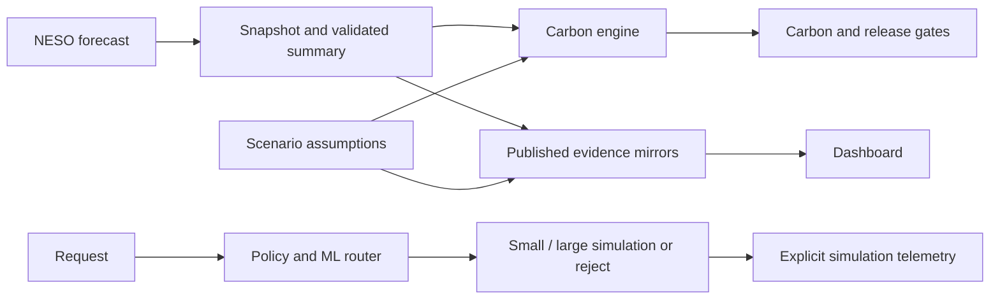

[](https://github.com/vlad12-k/green-ai-sizer-mvp/actions/workflows/release-validation.yml)

# Green AI Sizer

An inference-governance engineering prototype: explainable routing decisions,
reproducible carbon scenarios, a validated evidence pipeline, and a static
[governance dashboard](https://vlad12-k.github.io/green-ai-sizer-mvp/).

## Product boundary

**Implemented:** hybrid policy/ML routing, decision reasons and confidence,
conservative fallback, synthetic evaluation, canonical grid evidence, carbon
budget CI, dashboard provenance, and an optional Azure simulation endpoint.

**Simulated:** cache hits, latency and Wh per request. Carbon results are scenario
estimates using real grid forecast data and assumed energy values. Historical
probe evidence is not a measurement of LLM energy or answer quality.

**Future work:** hosted/local LLM providers, real response caching, measured
quality/cost/latency, workload profiling and production policy enforcement.
There is no live LLM invocation in this release. This is not a clinical system.

## Run and verify

Use Python 3.11 or 3.12, Node.js 22, and make:

```sh
python3 -m venv .venv
. .venv/bin/activate
python -m pip install -r app/requirements.txt
make verify
make verify-release
python -m http.server 8000 --bind 127.0.0.1 --directory docs
```

Open `http://127.0.0.1:8000`. Offline verification is reproducible without API
credentials. Release verification additionally rejects grid evidence older than
48 hours. To refresh it, run `python scripts/fetch_uk_grid_intensity.py`, then
`python workbook/evidence.py`, and submit the updated evidence as a PR.

## Architecture


```mermaid
flowchart LR
  A[NESO forecast] --> B[Snapshot and validated summary]
  B --> C[Carbon engine]
  D[Scenario assumptions] --> C
  C --> E[Carbon and release gates]
  B --> F[Published evidence mirrors]
  D --> F
  F --> G[Dashboard]
  H[Request] --> I[Policy and ML router]
  I --> J[Small / large simulation or reject]
  J --> K[Explicit simulation telemetry]
```

The engine and dashboard use the same canonical grid mean. Source/mirror drift,
invalid numeric inputs and stale release evidence fail validation. Daily refresh
opens a PR; there is no second writer pushing mirror commits directly to main.

## Router v2

`app/ml/router.py` returns route, reason, policy overrides, router version and
confidence. Confidence is an uncalibrated classifier probability, not answer
quality. A separate evaluation fixture records failures and conservative fallback.
See the [model card](docs/router-model-card.md) and
[evaluation report](docs/evidence/router_evaluation.json).

## Engineering workflow

Use short-lived branches from `main`, with one phase per PR. Review the final
diff, run `make verify-release`, and require green CI and CodeQL on the reviewed
SHA before merging. `carbon-budget` and `release-validation` are required checks.
[Azure deployment](docs/ops/azure-deployment.md) is optional, manually dispatched
from main and validates its exact commit before packaging.

## Documentation

- [Architecture](docs/architecture/system-architecture.md)
- [Data contract](docs/dashboard-data-contract.md) and [sources](docs/evidence/data-sources.md)
- [Verification](docs/ops/verification.md) and [release gates](RELEASE.md)
- [System boundary](docs/governance/system-boundary.md), [risk register](docs/governance/risk-register.md)
- [Changelog](CHANGELOG.md) and [release procedure](RELEASE.md)

The project originated as student work. Historical attribution and releases are
preserved; current claims are limited to the implemented and verified behavior.

## License

[Business Source License 1.1](LICENSE) for covered v0.2.0+ work. Non-production
use is permitted; Additional Use Grant is None. Each covered version changes to
GPL-3.0-or-later after four years. Prior MIT grants remain valid. External data,
dependencies and retained scaffolding keep their own terms: see
[notices](THIRD_PARTY_NOTICES.md) and [provenance audit](docs/license-provenance.md).
