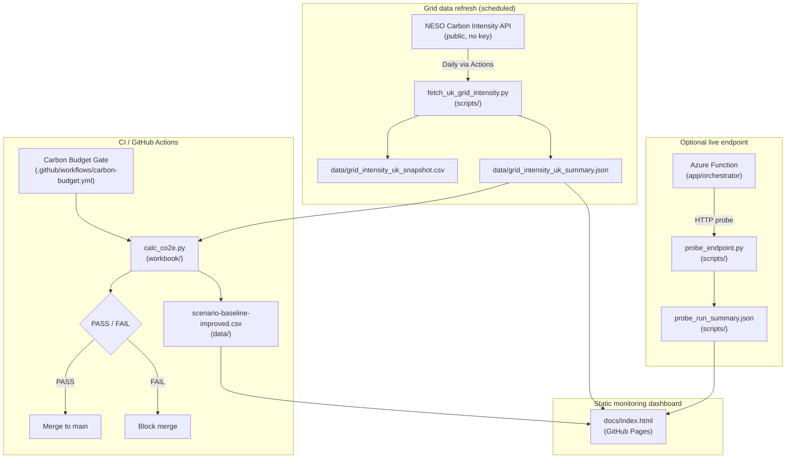

# System Architecture

## Overview

Green AI Sizer MVP is a governance-first evidence pack. Its architecture centres on a **CI Carbon Budget Gate** that enforces an emissions constraint on every pull request, supported by a reproducible calculation workbook, real-world grid-intensity data, an optional live Azure Function endpoint, and a static GitHub Pages monitoring dashboard.

No new Azure resources are required beyond the Function App already deployed. All monitoring is static and served from GitHub Pages.

---

## Component diagram



---

## Component descriptions

### Carbon Budget Gate

- **File:** `.github/workflows/carbon-budget.yml`
- **Trigger:** every pull request and push to `main`
- **Logic:** runs `python workbook/calc_co2e.py 200`; exits non-zero if the improved scenario exceeds the budget
- **Output:** GitHub Actions run summary showing budget, baseline, improved, and reduction %

### CO₂e calculator

- **File:** `workbook/calc_co2e.py`
- **Inputs:** `data/scenario-baseline-improved.csv` (scenario parameters)
- **Formula:** `wh_total = small_requests × wh_small + large_requests × wh_large`; `gco2 = (wh_total / 1000) × grid_intensity_g_per_kwh`; `g_per_1k = gco2 / (requests_per_day / 1000)`
- **Validation:** rejects missing fields, out-of-range rates, and non-positive request volumes

### Grid intensity data

- **Source:** NESO / UK Carbon Intensity API (`GET https://api.carbonintensity.org.uk/intensity/date`), public endpoint
- **Refresh:** `.github/workflows/refresh-grid-intensity.yml` — scheduled daily at 06:10 UTC, commits to `dev`
- **Evidence files:** `data/grid_intensity_uk_snapshot.csv` (raw), `data/grid_intensity_uk_summary.json` (min/avg/max summary)

### Optional Azure Function endpoint

- **File:** `app/orchestrator/__init__.py`
- **Deploy workflow:** `.github/workflows/dev_func-green-ai-sizer-mvp-01.yml` (triggered on push to `main`)
- **Function key:** stored in local `.env` only; never committed
- **Probe:** `scripts/probe_endpoint.py` collects cache hit rate, routing rate, latency percentiles, avg Wh/request

### Static monitoring dashboard

- **Files:** `docs/index.html`, `docs/styles.css`, `docs/app.js`
- **Hosted on:** GitHub Pages
- **Data sources:** `data/grid_intensity_uk_summary.json`, `scripts/probe_run_summary.json` (fetched at page load via relative paths)
- **No external APIs, no build tools, no CDN**

---

## Data flow summary

```
NESO API → fetch script → data/grid_intensity_uk_summary.json
                                      ↓
workbook CSV ← (manual update) ← probe_run_summary.json ← probe_endpoint.py ← Azure Function
       ↓
calc_co2e.py → CI gate (PASS/FAIL)

data/grid_intensity_uk_summary.json  ┐
scripts/probe_run_summary.json        ├─→ docs/index.html (GitHub Pages)
data/scenario-baseline-improved.csv ┘
```

---

## Screenshot slots

Place screenshots in `docs/assets/screenshots/` when available:

- `architecture.png` — this component diagram rendered
- `dashboard.png` — GitHub Pages monitoring dashboard
- `ci-gate.png` — Carbon Budget Gate Actions run summary

These are referenced from `README.md` and the dashboard governance view.
